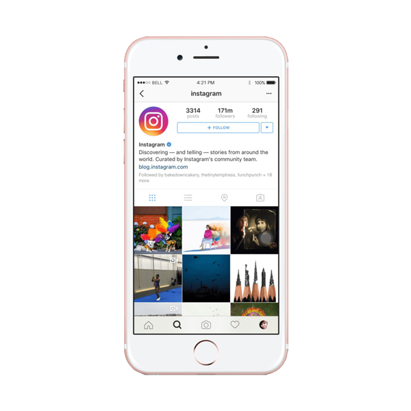

## Projeto Clone Tela Incial Instagram

Este é um clone da tela inicial do Instagram. Ele é construído com HTML, CSS e imagens. A tela mostra um celular com a aparência da interface do Instagram e permite que um usuário já logado possa continuar com sua conta ou remover a conta. Além disso, há uma opção para trocar de conta ou se inscrever em uma conta nova. Por fim, a tela também possui links para baixar o aplicativo do Instagram na App Store ou na Google Play Store.

## Requisitos:

- Conhecimento de HTML para estruturar a página e definir a estrutura de conteúdo.
- Conhecimento de CSS para estilizar a página e torná-la atrativa para o usuário.
- Conhecimento de boas práticas de programação, como organização do código e manutenção do código.

Além disso, um navegador web moderno e uma conexão à internet são requisitos básicos para que a aplicação possa ser acessada pelos usuários.

## index.html

Este é um código HTML para uma página web que representa a tela de login do aplicativo do Instagram. A página inclui elementos como um logotipo do Instagram, uma foto de perfil, opções para iniciar sessão com uma conta existente ou criar uma nova conta. Além disso, há um link para baixar o aplicativo do Instagram na App Store ou na Google Play Store. O código HTML está estruturado com tags, como head e body, e inclui referências a arquivos externos de folhas de estilo CSS para estilizar a página.

```html
<!DOCTYPE html>
<html lang="en">
<head>
    <meta charset="UTF-8">
    <!-- Configurações para o IE -->
    <meta http-equiv="X-UA-Compatible" content="IE=edge">
    <!-- Configuração de escalonamento de tela -->
    <meta name="viewport" content="width=device-width, initial-scale=1.0">
    <!-- Icone na aba do navegador -->
    <link rel="shortcut icon" href="src/img/logo.png" type="image/x-icon" />
    <!-- Título da página -->
    <title>Instagram</title>
    <!-- Importação do arquivo reset.css -->
<link rel="stylesheet" href="src/css/reset.css">
<!-- Importação do arquivo style.css -->
<link rel="stylesheet" href="src/css/style.css">
    <!DOCTYPE html>
<html lang="en">
<head>
    <meta charset="UTF-8">
    <!-- Configurações para o IE -->
    <meta http-equiv="X-UA-Compatible" content="IE=edge">
    <!-- Configuração de escalonamento de tela -->
    <meta name="viewport" content="width=device-width, initial-scale=1.0">
    <!-- Icone na aba do navegador -->
    <link rel="shortcut icon" href="src/img/logo.png" type="image/x-icon" />
    <!-- Título da página -->
    <title>Instagram</title>
	<!-- Importação do arquivo reset.css -->
	<link rel="stylesheet" href="src/css/reset.css">
	<!-- Importação do arquivo style.css -->
	<link rel="stylesheet" href="src/css/style.css">
</head>
<body>
   <!-- Container principal -->
   <div class="instagram-wapper">
    <!-- Container do celular -->
    <div class="instagram-phone">
        <!-- Imagem do celular -->
        
    </div>
    <!-- Container de conteúdo -->
    <div class="instagram-continue">
        <!-- Container de grupo -->
        <div class="group">
            <!-- Imagem do logo do Instagram -->
            
            <!-- Container da foto de perfil -->
            <div class="profile-foto">
                <!-- Imagem da foto de perfil -->
                
            </div>
            <!-- Botão de "Continue como edvaldo.dev" -->
            <a 			          href="https://www.instagram.com/edvaldo.dev/"class="instagramlogin"target="_blank">Continue como edvaldo.dev</a>
            <!-- Botão de "Remover conta" -->
            <a href="#" class="instagram-logout">Remover conta</a>
        </div>
        <!-- Container de grupo -->
        <div class="group">
            <!-- Texto "Não é edvaldo.dev" -->
            <p class="not-account">Não é edvaldo.dev</p>
            <!-- Texto com links para trocar de conta ou se inscrever -->
            <p class="notaccount">
                <span class="link-blue">Trocar de conta</span>
                ou
                <span class="link-blue">Inscreva-se</span>
            </p>
        </div>
        <!-- Container para baixar o aplicativo -->
        <div class="get-the-app">
            <!-- Bloco que exibe a mensagem "Baixe o aplicativo" -->
			<p class="get-">Baixe o aplicativo</p>
			<!-- Bloco contendo os links para download do aplicativo -->
		<div class="download">
 		 <!-- Link para download na App Store -->
  		<a href="https://apps.apple.com/br/app/instagram/id389801252" target="_blank" class="app-download" ></a>
  			<a href="https://play.google.com/store/apps/detailsid=com.instagram.android&hl=pt_BR&gl=US" target="_blank" class="app-download"></a>
</div>
</div>
</div>
</body>
</html>

```

## reset.css

Este é um estilo CSS para o corpo da página. Ele define as propriedades para todos os elementos da página, incluindo a largura do corpo como 100%, altura mínima de 100vh, cor de fundo como cinza claro (rgb (243, 243, 243)), sem margens, sem padding e com um display flex justificado ao centro. Além disso, define o tipo de fonte como sans-serif, tamanho da fonte como 14px e não inclui decorações de texto.

```css
* {
    padding: 0;
    margin: 0;
    box-sizing: border-box;
    text-decoration: none;
    font-family: sans-serif;
    font-size: 14px;
  }
  
  body {
    width: 100%;
    min-height: 100vh;
    background-color: rgb(243, 243, 243);
    margin: 0;
    padding: 0;
    display: flex;
    justify-content: center;
  }
```

## style.css

Esse código CSS dá estilos a uma página de login e inscrição do Instagram. O corpo tem uma altura mínima de 100vh e uma cor de fundo cinza. O invólucro principal é ajustado para 60% da largura do corpo, alinhado para iniciar e com uma altura de 100vh. A imagem do telefone é definida para 50% da largura do invólucro, centralizada vertical e horizontalmente. A imagem do telefone tem uma altura de 50rem.

A seção de continuação tem uma largura de 50% do invólucro e uma altura mínima de 34rem. Os itens internos são alinhados e justificados para serem centralizados vertical e horizontalmente. Há uma classe de grupo para estilizar o fundo branco com borda e preenchimento, a primeira criança tem uma altura mínima de 19rem.

O logotipo do instagram tem uma altura de 3rem. A seção de foto de perfil está configurada para ter uma forma circular e a altura da foto é de 7,5 rem. O botão de login tem uma cor de fundo azul e uma cor de texto branca, enquanto o texto de logout tem cor azul. O texto sem conta tem uma cor cinza claro.

A seção get-the-app tem uma largura de 100%, e os itens dentro são alinhados e justificados para serem centralizados vertical e horizontalmente. A seção de download tem uma largura de 100%, e os itens dentro são justificados para serem espaçados uniformemente. A classe de download do aplicativo estiliza os botões Apple e Google Play, cada um com uma altura de 3rem e largura de 10rem.

As consultas de mídia ajustam o layout para telas menores. Para telas com largura inferior a 1024px, a largura do invólucro principal é definida como 90%. Para telas com largura inferior a 650px, a cor do plano de fundo do corpo muda para branco, a imagem do telefone fica oculta e a largura da seção continuar é definida como 100%. A borda do grupo é definida como transparente.

```css
.instagram-wapper {
    display: flex;
    align-items: center;
    justify-content: start;
    width: 60%;
    height: 100vh;
  }
  
  .instagram-phone {
    display: flex;
    align-items: center;
    justify-content: center;
    width: 50%;
  }
  
  .instagram-phone img {
    height: 50rem;
  }

  .instagram-continue {
    display: flex;
    align-items: center; /* horizontal */
    justify-content: space-around; /* vertical */
    flex-direction: column;
    width: 50%;
    min-height: 34rem;
  }

  .group {
    background-color: #ffffff;
    display: flex;
    justify-content: space-between;
    align-items: center;
    flex-direction: column;
    width: 100%;
    padding: 1.3rem 0;
    border: 1px solid lightgray;
  }
  
  .group:nth-child(1) {
    min-height: 19rem;
  }

  .instagram-logo {
    height: 3rem;
  }
  
  .profile-foto {
    display: flex;
    justify-content: center;
    align-items: center;
    border-radius: 50% ;
    overflow: hidden;
  }

  .profile-foto img {
    height: 7.5rem;
  }

  .instagram-login {
    background-color: #0095f6;
    color: #ffffff;
    padding: 8px;
    border-radius: 4px;
  }

  .instagram-logout {
    color: #0095f6;
    margin-top: 1rem;
  }

  .not-account {
    color: rgb(160, 160, 160);
  }

  .link-blue {
    color: #0095f6;
  }

  .get-the-app{
    display: flex;
    flex-direction: column;
    align-items: center;
    justify-content: center;
    width: 100%;
    padding: 1.3rem 0;
  }

  .download {
    display: flex;
    width: 100%;
    justify-content: space-evenly;
    align-items: center;
    padding: 1rem;
  }

  .app-download {
    height: 3rem;
    width: 10rem;
    background-size: cover;
  }

  .app-download:nth-child(1) {
    background-image: url(../img/apple-button.png);
  }

  .app-download:nth-child(2) {
    background-image: url(../img/googleplay-button.png);
  }

  /* medias queries */

@media (max-width: 1024px) {
    .instagram-wapper {
      width: 90%;
    }
  }
  
  @media (max-width: 650px) {
    body {
      background-color: #ffffff;
    }
    .instagram-wapper {
      width: 90%;
    }
    .instagram-phone {
      display: none;
    }
    .instagram-continue {
      width: 100%;
    }
    .group {
      border: 1px solid transparent;
    }
  }
```

## Hospedagem:

Este clone da tela inicial do Instagram está hospedado no GitHub Pages, uma plataforma gratuita para hospedagem de páginas web. GitHub Pages permite que você publique seus projetos de forma rápida e fácil, permitindo que você compartilhe seu trabalho com o mundo. Com GitHub Pages, você pode ter seu próprio site com um endereço personalizado, sem precisar se preocupar com a configuração do servidor ou gerenciamento de infraestrutura. Além disso, você pode usar o recurso de versionamento do GitHub para acompanhar e controlar as alterações no seu código ao longo do tempo.

## Acesse o Link e confira:

##  https://edvaldoljr.github.io/Projeto-FrontEnd-Clone-Tela-Inicial-Instagram/


# ⭐️ **Deixe um Star** ⭐️

Obrigado por conferir meu repository! É muito gratificante saber que alguém está interessado no meu trabalho. Se você gostou do que viu, deixar um star seria uma grande ajuda no meu crescimento e me motivaria a continuar fazendo projetos. O apoio de pessoas como você é fundamental para que eu possa seguir evoluindo e produzindo conteúdos cada vez melhores. Obrigado mais uma vez e espero que você possa acompanhar meus futuros projetos!